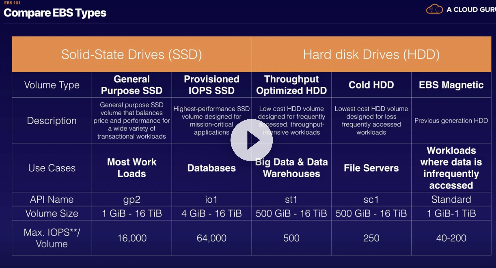

# Notes for AWS Certified Solutions Architect Associate

I recently got the AWS solutions architect associate certificate in July 2019, and wanted to share my notes with anyone who might benefit from it. The path I followed was

- Go through the [ACloudGuru course](https://click.linksynergy.com/deeplink?id=aosskmXRdYk&mid=39197&murl=https%3A%2F%2Fwww.udemy.com%2Faws-certified-solutions-architect-associate%2F).
- Attempt the [Whizlabs practice tests](https://www.whizlabs.com/aws-solutions-architect-associate/). After each test, note down the concepts I had difficulties with. 
- Attempt the [practice tests by Jon Bonso at Udemy](https://click.linksynergy.com/deeplink?id=aosskmXRdYk&mid=39197&murl=https%3A%2F%2Fwww.udemy.com%2Faws-certified-solutions-architect-associate-amazon-practice-exams%2F). Again, after each test, note down the concepts I had difficulties with.

So you should go through the notes only after you have done a course that explains the basics, such as the one from ACloudGuru. Also, full disclosure, the links to the above courses are referral ones. So if these notes helped you and you're planning to buy the courses or practices tests, please consider going through the links when you're buying.

__Note__ — You can also check out [this blog post](https://sumit-ghosh.com/articles/aws-solutions-architect-associate-preparation/) where I describe my preparation strategy in detail. 

## Contents

- [Well-Architected Framework](#well-architected-framework)
- [Route 53](#route53)
- [S3](#s3)
- [RDS, Redshift and ElastiCache](##rds-redshift-and-elasticache)
- [EBS](#ec2-and-ebs)
- [EFS](#efs)
- [ELB and Autoscaling](#elb-and-autoscaling)
- [SQS](#sqs)
- [SNS](#sns)
- [API Gateway](#api-gateway)
- [Lambda](#lambda)
- [VPC](#vpc)
- [DynamoDB](#dynamodb)
- [ECS](#ecs)
- [Elastic Beanstalk](#elastic-beanstalk)
- [Storage Gateway](#storage-gateway)
- [IAM, Cognito and Directory Services](#iam-cognito-and-directory-services)
- [KMS and CloudHSM](#kms-and-cloudhsm)
- [Kinesis](#kinesis)
- [EMR](#emr)
- [Misc](#misc)

# Well-Architected Framework

The five pillars are —

1. Operational Excellence 
2. Security
3. Reliability
4. Performance Efficiency
5. Cost Optimization

## Operational Excellence

### Design Principles

- Perform operations as code
- Annotate documents
- Make frequent, small, reversible changes
- Refine operations procedures frequently
- Anticipate failure
- Learn from all operational failures

### Best Practices

- Prepare
- Operate
- Evolve

__Key AWS Service__ — AWS CloudFormation.

## Security

### Design Principles

- Implement a strong identity foundations
- Enable traceability
- Apply security at all layers
- Automate security best practices
- Protect data in transit and at rest
- Keep people away from data
- Prepare for security events

### Best Practices

- Identity and Access Management
- Detective Controls
- Infrastructure Protection
- Data Protection
- Incident Response

__Key AWS Service__ — AWS Identity and Access Management (IAM).

## Reliability

### Design Principles

- Test recovery procedures
- Automatically recover from failure
- Scale horizontally to increase aggregate system availability 
- Stop guessing capacity
- Manage change in automation

### Best Practices

- Foundations
- Change Management
- Failure Management

__Key AWS Service__ — Amazon CloudWatch.

## Performance Efficiency

### Design Principles

- Democratize advanced technologies
- Go global in minutes
- Use serverless architecture
- Experiment more often
- Mechanical sympathy

### Best Practices

- Selection
    - Compute
    - Storage
    - Database
    - Network
- Review
- Monitoring
- Tradeoffs

__Key AWS Service__ — Amazon CloudWatch.

## Cost Optimization

### Design Principles

- Adopt a consumption model
- Measure overall efficiency
- Stop spending money on data center operations
- Analyze and attribute expenditure
- Use managed and application level services to reduce cost of ownership

### Best Practices

- Expenditure Awareness
- Cost-Effective Resources
- Matching Supply and Demand
- Optimizing Over Time

__Key AWS Service__ — Cost Explorer.

# Route53

__Main functions of Route53__ —
1. Register domain names.
2. Route internet traffic to the resources for your domain.
3. Check the health of your resources.

It's not used to _distribute_ traffic.

__CNAME vs ALIAS__ —  

- For routing to S3 bucket // Elastic load balancer use A record with ALIAS.  
- For routing to RDS instance use CNAME with NO ALIAS // without ALIAS.

ALIAS only supports the following services —
- API Gateway
- VPC interface endpoint
- CloudFront distribution
- Elastic Beanstalk environment
- ELB load balancer
- S3 bucket that is configured as a static website
- Another Route 53 record in the same hosted zone

Route53 does not directly log to S3 bucket, we can forward that from Cloudwatch, but can't do it directly.

Types of __Route53 health checks__ —
1. Health checks that monitor __an endpoint__. This __can be on-premise__ too.
2. Health checks that monitor __other health checks__.
3. Health checks that monitor __Cloudwatch alarms__. 

__Multivalue answer routing policy__ responds with upto 8 healthy records selected at __random__.

__Weighted routing policy__ is a good fit for __blue-green deployments__.

# EC2

- is a web service that provides resizable compute capacity in the cloud. It reduces the time required to obtain and boot new server instances to minutes, allowing you to quickly scale capacity, both up and down, as your computing requirements change.
- *Pricing Models*
    - You pay as you go and for what you use, pay less as you use more, 
    - **On Demand** - allows you to pay a fixed rate by the hour (or by the second) with no commitment. Great for development
        - Is useful when wanting a low cost and flexibility of EC2 without any up-front payment or long-term commitment
        - Applications with short term, spiky, or unpredictable workloads that cannot be interrupted.
        - Applications being developed or tested on EC2 for the first time
    - **Reserver** - provides you with a capacity reservation, and offer a significant discount on the hourly charge for an instance. Contract Terms are 1 year or 3 year terms. The more you pay upfront, the more you are going to save
        - Application with steady state or predictable usage
        - Applications that require reserved capacity
        - Users able to make upfront payments to reduce their total computing costs even further 
        - **Reserve Pricing Types**
            - Standard Reserver instances - offer up to 75% off demand instances. The more you pay up front and the longer the contract, the greater the discount
            - Convertible Reserver instances - offer up to 54% off on demand capability to change the attributes of the RI as long as the exchange results in the creation of Reserver Instances of equal or greater value
            - Scheduled Reserver instances - are available to launch within the time windows you reserve. It allows you to match your capacity reservation to a predictable recurring schedule that only requires a fraction of a day, week, month
    - **Spot** - enables you to bid whatever price you want for instance capacity, providing for even greater savings if your applications have flexible start and end time. You state the price, once price is meet, instance is created. If price increases, the instance will be removed.
        - Application that are only feasible at very low computing prices
        - Applications that have flexible start and end time.
        - Users with urgent computing needs for large amounts of additional capacity
        - *Note*. If the spot instace is terminated by EC2, you will not be charged for a partial hour of usage. However, if you terminat the instance yourself, you will be charged for any hour in which the instance ran
    - **Dedicated Hosts** - physical EC2 server dedicated for your use. Dedicated Hosts can help you reduce costs by allowing you to use your existing server-bound software licenses
        - Useful for regulatory requirements that may not support multi-tenant virtualization
        - Great for licensing which does not support multi-tenancy or cloud deployments
        - Can be purchased On-Demand (hourly)
        - Can be purchased as a Reservation for up to 70% off the On-Demand price

__Security groups__
- All Inbound traffic is blocked by default
- All Outbound traffic is allowed
- Changes to Security groups take immediately
- You can have multiple EC2 on the same security group and vice versa
- Security groups are stateful - if you create an inbound rule allowing traffic in, that traffic automatically allowed as outbound
- You cannot block specific IP using security groups, only Network Access Control List
- You can only specify allow rules, not deny

__EBS__
- Elastic Block Storage - provides persistent block storage volumes for use with EC2. Each EBS volume is automatically replicated within its AZ to protect you from component failure, offering high availability and durability
- To change the region of EBS, first create a snaphot to capture the image, create an AMI from the snapshit and then use the AMI to launch the EC2 in a new AZ
- When terminate EC2, the root volume will be deleted. However, additional volumes will remain
- Snapshots exist on S3 while volumes exist on EBS
- Snapshot are point in time copies of volumes.
- To create a snapshot, you should stop the instance before taking the snapshot. But you can take it while running
- You can create AMis from snapshits
- Volumes are always in the same region as EC2.

*Types*
1. General Purpose (SSD)
2. Provisioned IOPS (SSD) - really fast input/output per second
3. Throughput Optimised Hard Disk Drive - Physical 
4. Cold Hard Disk Drive
5. Magnetic

__AMI__
Can be selected on
- Region
- OS
- Architecture (32-bit or 64-bit)
- Launch Permissions
- Storage for the Root device
    1. Instance Store (Emhemeral storage) - cannot be stopped. If underlying host fails, you will lose your data
    2. EBS backed volumes - can be stopped. Will not lose your data if instace is stopped
- By default both ROOT volumes will be deleted on EC2 termination. However, with EBS volumes, you can tell AWS to keep the root device volume

__ENI, ENA, EFA__
- *ENI - elastic network interface* - essentially a virtual network card. Choose for basic networking, or manage multiple networks at low cost
    1. Primary private IPv4 address from the IPv4 address range of your VPC
    2. One or more secondary private IPv4 addresses from the IPv4 address range of your VPC
    3. One Elastic IP address (IPv4) per private IPv4 address
    4. One public IPv4 address
    5. One or more IPv6 addresses
    6. One or more security groups
    7. A mac address
    8. A source/destination check flag
    9. Description

- *EN - Enhanced networking*. Uses single root I/O virtualization to provide high-performance networking capabilities on supported instance types
    1. Provides higher I/O performance and lower CPU utilization when compared to traditional virtualised network interface. Provides higher bandwidth, packet per second performance and lower inter-instance latencies. There is no additional charge for using enhanced networking, but EC2 must support it.
    2. To use where you want good network performance
    3. Can be enabled using:
        - *Elastic Network Adapter (ENA)* which supports network speeds of up to 100Gbps for supported instance types. Always choose this method
        - *Virtual Function (VF)* interface - suports network speeds of up to 10Gbps for supported instance types. This is typically used on older instances. 
    4. Choose for when you need speeds between 10Gbps and 100Gbps and reliable and high throughput.
    
- *Elastic Fabric Adapter* - a network device that you can attach to your EC2 instance to accelerate High Performance Computing and ML applications
    1. Choose for when you need to accelerate High Performance Comouting (HPC) and ML applications or if you need to do an OS by-pass. 

__SPOT instances and fleets__
- Use unused EC2 capacity in the AWS cloud. Are available at up to 90% discount comparaed to On-Demand. Can use for stateless, fault-tolerant or flexiable applications, such as big data, containeriz workloads, CI/CD, web servers, HPC and other test workloads. They are not good for persistent workloads, critical jobs and databases
- To use the Spot Instances, you must first decide on your maximum Spot price. The instance will be provisioned so long as the Spot price is below your maximum Spot price. Hourly spot price varies depending on capacity and region
- If spot price goes above your maximum, you have two minutes to choose wheter to stop or terminate your instance
- You can use *Spot block* to stop your Spot Instances from being terminated even if the Spot price goes over your maximum Spot price. You can set Spot blocks for between one to six hours currently. 
- *Procces of creating a spot instance*
    1. Create a request (Maximum price, Desired amount of instances, Launch specifications, Request type (one time or persistent), Timeline (Valid from and valid until))
    2. Launch the instance. If the price increases, one time instances will be removed, while persistent will be removed and launched again once th eprice meets the criteria 

*Spot fleets*
- Is a collection of Spot Instances and optionally, On-Demand instances.
- The spot fleet attempts to maintain its target capacity fleet if your spot instances are interupted.
- Tasks done:
    1. Set up different launch pools. Define things like EC2 instance type, OS and AZ
    2. You can have multiple pools, and the fleet will choose the best way to implement depending on the strategy youd define. Strategies:
        - *capacityOptimized* - The spot instances come from the pool with optimal capacity for the number of instances launching
        - *diversified* - The spot instaces are distributed across all pools
        - *lowerPrice* - the spot instances come from the pool with the lowest price. This is the default strategy
        - *InstancePoolsToUseCount* - the spot instaces are distributed across the number of spot instance pool ypu specify. This parameter is valid only when used in combination with lowestPrice
    3. Spot fleets will stop launching instances once you reach your price threshold or capacity desire

*EC2 Hipernate*
- When you hibernate an EC2 instance, the OS is told to perform hibernation. It saves the contents from the instance memory RAM to your EBS root volume.
- OS does not need to reboot, since the RAM contents are reloaded, rovides much faster boot up
- It requires to have root volume encryption
- Instance RAM must be less than 150 GB
- Can't be hibernated for more than 60 days

*Cloudtrail*
- increases visibility into your user and resource activity by recording AWS Management COnsole actions and API calls

*Cloudwatch*
- Can monitor most of AWS as well as your applications that run on AWS
- CloudWatch with EC2 will monitor events every 5 minutes by default
- You can have 1 miunte intervals by turning on detailed monitoring

*IAM Roles*
- Roles are more secure than storing your access and secret keys on individual EC2 instances.
- Roles are easier to manage
- Roles can be assigned to EC2 instances after it is created using both console and command line
- Roles are universal - can be used in any region

*EFS*
- Elastic file system - file storage for EC2
- Provides simple interface that allows you to create and configure file systems quickly and easily
- Storage capacity is elastic, growing and shrinking automatically as you add and remove files
- Instances can share single EFS, but not EBS
- Integrates life cycle policies
- Requires NFS protocol allowed in the security group to communicate with EC2
- You pay only for what you use
- Can support thousands of concurrent NFS connections and can scale up to the petabytes
- Data is stored across multiple AZ's within a region
- Read After Write consistency
- EC2 running windows cannot connect to EFS, only linux and unix based. If it is windows server, it should use FSx Windows

*FSx (File Server)* 
- **For windows**: provides a fully managed native Microsoft Windows file system so you can easily move your Windows-based applications that require file storage to AWS. It is built on Windows server
    1. It is a managed Windows Server that runs Windows Server Message Block (SMB)-baed file services
    2. Designed for windows
- **FSx for Lustre** - fully managed file system that is optimized for compute-intensive workloads, such as high-performance computing, ML, media data processing workflows and electronic design automatino (EDA
    1. You can launch and run a Lustre file system that can process massive data sets at up to hundreds of gigabytes per second of throughput, millions of IOPS and sub-milisecond latencies

**When to use EFS, FSx for windows or FSx for Lustre**
- EFS - when you need distributed, highly resilient storage for Linux instances and linux-based applications
- FSx for windows - when you need centralised storage for windows based applications
- FSx for Lustre - when you need high-speed, high-capacity distributed storage. It can store data directly on S3

__EC2 placement groups__
- When you launch a new EC2 instance, the EC2 service attempts to place the instance in such a way that all of your instances are spread out across underlying hardware to minimize correlated failures.
- The name for placement group must be unique within your AWS account
- You cant merge placement groups
- You can move existing instance into a placement group. Before you can move the instance, the instsance must be stopped. It can only be achieved using AWS CLI or SDK, not yet with a console
1. Clustered Placement group
    - Grouping instances within a single AZ (put them very close together)
    - Recommented for applications that need low network latency, high network throughput, or both
    - Only certain instances can be launched in this group
    - Cant span multiple AZ, all other groups can
    - AWS recommneds homogenous instances within clustered pplacement group
2. Spread Placement group
    - Each instance is placed on distinct underlying hardware
    - Recommended for applications that have a small number of critical instances that should be kept separate from each other
    - For example if one applications fails, it should not effect the others
    - Can have in different AZ within a region
    - Think like separate instances
3. Partitioned
    - AWS divides each group into logical segments called partitions.
    - Each partition within a placement group has its own set of racks. Each eack has its own network and power source.
    - No two partitions within a placement group share the same racks, allowing you to isolate the impact of hardware failure within your application
    - Think like multiple instances

__High performance computing (HPC)__
- Create a large number of resources in almost no time. You only pay for the resources you use - and, once finished, you can destroy them
- Can be achieved by these services
1. Data transfer (get data into AWS)
    - *Snowball, SNowmobile* (terabytes/petabytes worth of data)
    - *AWS DataSync* to store on S3, EFS, FSx for Windows
    - *Direct Connect* (cloud service that established a dedicated network connection from your premises to AWS.)
2. Compute and networking
    - CPU or GPU optimized
    - EC2 fleets (Spot instances or fleets)
    - Placement groups (cluster placement groups)
    - Enhanced networking
        1. Uses single root I/O  (SR-IOV)virtualization to provide high-performance networking on supported instance tpypes. Provides higher I/O performance and lower CPU utilization.
        2. Use where you want good network connection
        3. Provies higher bandwidth, higher packet per second performance, consistently lower inter-instance latencies. There is additional charge for this service
        4. Can be enabled using:
            - *Elastic Network Adapter* - supports network speed of up to 100Gbps (Chose during exam)
            - *Virtual Function* interface, supports network speed up to 10 Gbps used for legacy systems
    - Elastic Network Adapters
    - Elastic Fabric Adapters
        1. Is a network device you can attach to your EC2 to accelerate HPC and ML applications
        2. Provides lower, more consistent latency and higher throughput than the TCP protocol.
        3. Can us OS-bypass, allows HPC and ML applications to bypass OS kernel and communicate directly with the EFA device. Only linux
3. Storage
    1. Instance-attached storage
        - EBS
        - Instance Store - scale to millions of IOPS, low latency
    2. Network storage
        - S3
        - EFS
        - FSx
4. Orchestration and automation
    - AWS Batch - batch computing jobs
    - ParallelCluster

__WAF__
- Monitors HTTP and HTTPS requests that are forwarded to CloudFront, ALB or API gateway
- Lets you control access to your content
- Allows three different behaviours:
    1. Allow all requests except the ones you specify
    2. Block all requests except the ones you specify
    3. Count the requests that match the properties you specify

